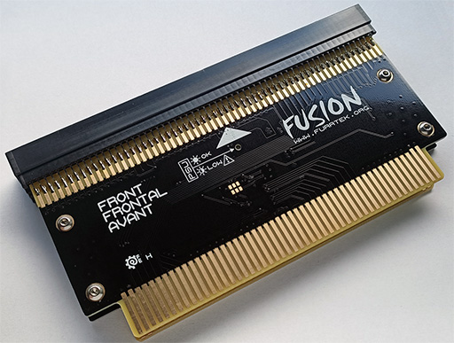

# FusionConverter

PCB GERBERs, BOM, Verilog and Quartus assignments files.

Compatibility list: https://wiki.neogeodev.org/index.php?title=Fusion_converter

# Note to JGO

* You were dumb enough to clone an open-hardware project. You could just have used these files.
* You're not respecting the license.
* If you cloned a device without paying attention to its open-source nature, that means you would also clone closed-source devices without caring.

From all the people who create things and share them for free: Fuck you.
